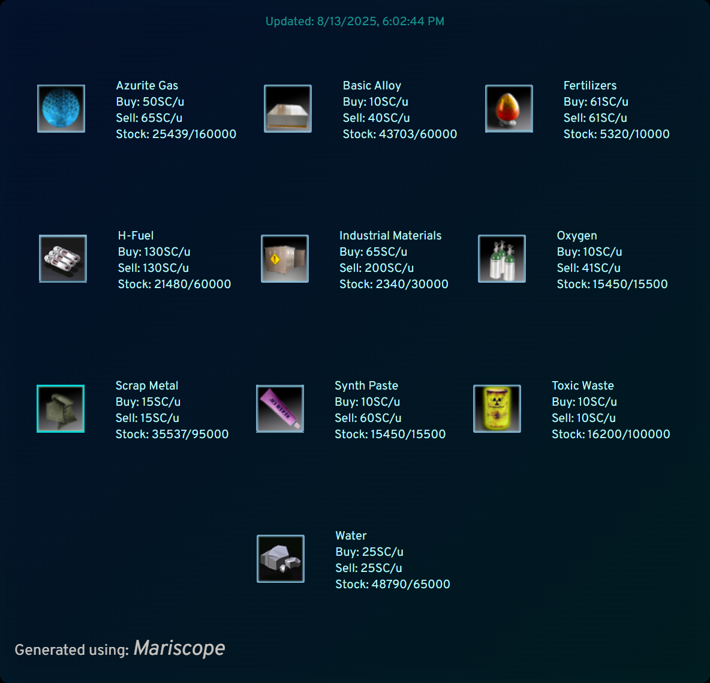

# **Mariscope v0.5.0**

Mariscope is a simple Node.js scraper and renderer tool made for the *Discovery Freelancer* MMO RP server community — and originally, just for me.
Its main purpose is to generate up-to-date, visually appealing images of Player Owned Base (PoB) commodity data for use in the DiscoveryGC Forum’s Player Owned Base RP section.

Instead of manually editing forum posts, Mariscope can upload an image to a fixed URL (via Cloudinary), meaning your forum post always shows the newest image automatically — saving you a lot of time and clicks.

---

## **Project Overview**

The idea behind Mariscope is to automate the collection and visualization of PoB commodity trade information, so players can present their trading data in a clean, easy-to-read image format without manual post updates.

Currently, Mariscope:

1. Scrapes the latest commodity data from PoBs.
2. Renders that data into a nicely formatted image.
3. (Optionally) Uploads the image to **Cloudinary** at a fixed address, returning the image URL.

If the Cloudinary upload is disabled or fails, the generated files are still available locally in:

* `PoBs/[PoB name]/info.png` → rendered image
* `PoBs/[PoB name]/info.json` → raw data in JSON format

This module is part of a larger idea for a hosted automation service, but at the moment only the scraper, renderer, and optional Cloudinary uploader are complete.

---

## **Features**

* Scrape commodity trade data from Player Owned Bases in *Discovery Freelancer*
* Render that data into a single clean image for forum display
* Optional automatic Cloudinary upload to a fixed URL
* Local file saving as fallback (PNG & JSON)
* Configurable scraping targets and display options
* CLI and library usage support
* Debug mode with Puppeteer non-headless option for troubleshooting

---

## **Installation**

Clone the repository and install dependencies:

```bash
git clone https://github.com/yourusername/mariscope.git
cd mariscope
npm install
```

---

## **Configuration**

### **Main Config**

Mariscope uses a `config.json` file for:

* `debug` → Enables verbose logging and non-headless mode
* `selectors` → CSS selectors for finding PoB data
* `img` → URLs or local paths for commodity images
* `noImg` → Fallback image if a commodity image is missing

### **Cloudinary Config**

For uploads, you’ll need to edit `clConfig.json` with your Cloudinary credentials:

```json
{
  "cloud_name": "your_cloud_name",
  "api_key": "your_api_key",
  "api_secret": "your_api_secret"
}
```

If you don’t configure Cloudinary, or you disable uploads, Mariscope will simply save images locally.

---

## **Usage**

### CLI Usage

The CLI supports the following arguments:

```js
const args = minimist(process.argv.slice(2), {
  boolean: ['clean', 'debug', 'uploadOff'],
  string: ['pobName', 'config', 'clConfig'],
  alias: { c: 'config', d: 'debug' , cl: 'clean' , nm: 'pobName'},
  default: { config: './config.json' , uploadOff: false , debug: false , clean: false , clConfig: './clConfig.json'}
});
```

#### Examples

Run with default settings (will not find anything without a PoB name):

```bash
node CLI.js
```

Run with a custom PoB name:

```bash
node CLI.js --pobName "Your PoB Name"
```

Run with debug logging:

```bash
node CLI.js --pobName "Your PoB Name" -d
```

Clean the output directory before running:

```bash
node CLI.js -cl
```

Disable Cloudinary upload (save locally only):

```bash
node CLI.js --pobName "Your PoB Name" --uploadOff
```

Set your Cloudinary config path (if you have a Cloudinary account and don’t want to modify the provided clConfig.json):

```bash
node CLI.js --pobName "Your PoB Name" --clConfig "Your Cloudinary Config Path"
```
---

### **As a Library**

```js
import { mariscope } from 'mariscope';

(async () => {
  try {
    const result = await mariscope({
      config: './config.json',
      debug: false
    });
    console.log(result);
  } catch (err) {
    console.error(err);
  }
})();
```

---

### Example: Fetching Mariscope Data Every 2 Hours

This example demonstrates how to use the `mariscope` library in a server-like local environment. The script fetches data immediately and then repeats every 2 hours. You can stop the loop gracefully with **Ctrl+C**.

#### Usage

1. Make sure you have `mariscope` installed and a valid `config.json`:

```bash
npm install mariscope
```

2. Run the script:

```bash
node fetchMariscope.js
```

#### Example Script (`fetchMariscope.js`)

```js
import { mariscope } from 'mariscope';

const fetchData = async () => {
  try {
    const result = await mariscope({
      config: './config.json',
      debug: false
    });
    console.log(result);
  } catch (err) {
    console.error(err);
  }
};

// Run immediately
fetchData();

// Schedule to run every 2 hours
const interval = setInterval(fetchData, 2 * 60 * 60 * 1000);

// Handle graceful shutdown (Ctrl+C)
process.on('SIGINT', () => {
  console.log('Stopping fetch loop...');
  clearInterval(interval);
  process.exit();
});
```

**Notes:**

* Adjust the `config` path if needed.
* `debug: false` can be changed to `true` for verbose logging.
* This script is intended for local development or server-like environments.

---

## Example Output

Here’s an example of what the script renders:



---

## **Future Plans**

* Build a simple web UI to configure PoB scraping and uploads
* Host Mariscope on a dedicated server for automated forum updates
* Multi-PoB support in a single run
* Possible forum integration for posting updates directly

---

## **License**

MIT License © M.C.R.

---

## **Contribution**

This is a personal side project I built mostly for my own amusement and convenience — I wanted a “set-and-forget” way to keep forum PoB posts updated.
I’m not actively seeking contributions, but I won’t stop anyone who wants to help. If you do want to suggest improvements or submit pull requests, **please open an issue first** so we can discuss it.

---

## **Contact**

Questions or feedback? Email me at: [vuk.s.maric@gmail.com](mailto:vuk.s.maric@gmail.com)
